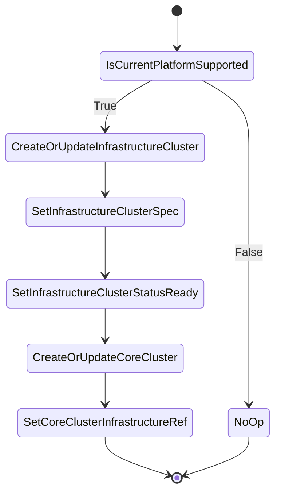

# Cluster controller

## Overview

Cluster controller is responsible managing Cluster and InfrastructureCluster(AWSCluster, etc.) CRs. Both object will
represent the current cluster where operator is running because we treat this cluster as both management and workload.

## Behavior

If the current platform is not supported, the controller will not create any cluster objects and allow BYO scenarios.
In case when the platform is supported, the controller will create the appropriate infrastructure cluster object. It
will set cluster externally managed annotation `"cluster.x-k8s.io/managed-by"` and `Status.Ready` to `true` that indicates that the cluster is managed by current controller and not by CAPI infrastructure provider. It will also set cluster spec
to contain appropriate values like region, etc. if required.
