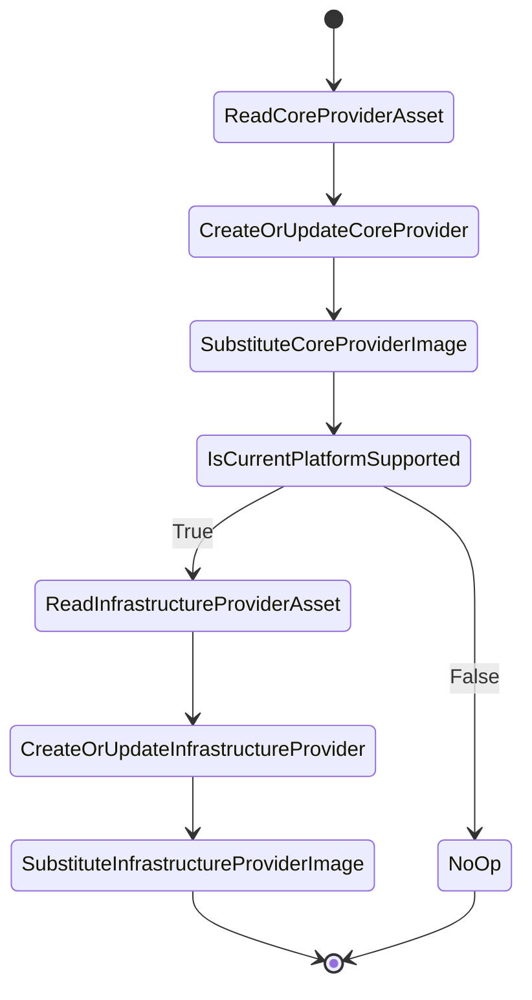

# Cluster operator controller

## Overview

Cluster operator controller is responsible for managing the CoreProvider and InfrastructureProvider CRs.
These CRs are later reconciled by the upstream [Cluster API Operator](https://github.com/kubernetes-sigs/cluster-api-operator).

## Behavior

Operator will create CoreProvider even if current platform is not supported, this allows BYO scenarios. If the
platform is supported, the operator will create the appropriate InfrastructureProvider.
