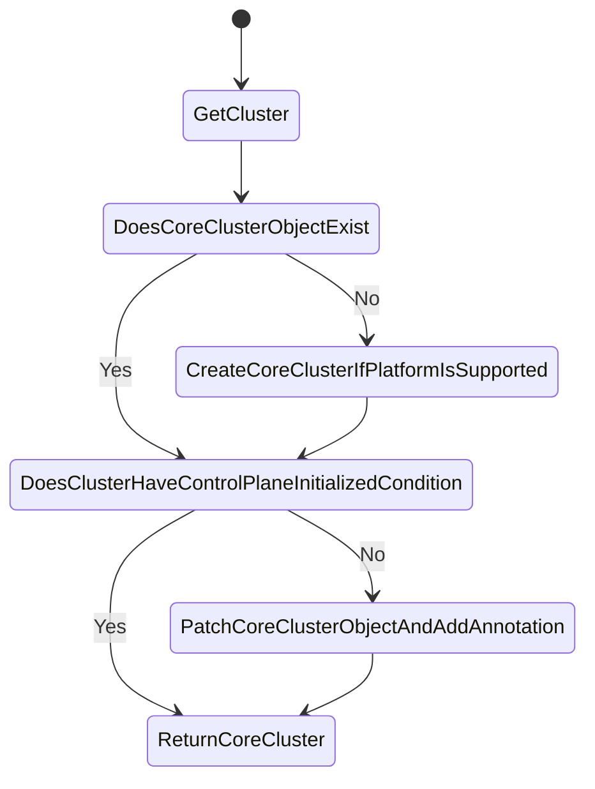

# Core Cluster Controller

## Overview

[Core cluster controller](../../pkg/controllers/cluster/infra.go) is responsible for reconciling the core cluster object in the `openshift-cluster-api` namespace. It ensures that the infrastructure and control plane for the cluster are initialized (by setting the ControlPlaneInitialized annotation) and available.
This controller will only manage cluster objects on supported platforms, and should fail early if the cluster platform is unsupported.

## Key Features

- Ensures the core cluster object is created and reconciled.
- Maps supported OpenShift platform types to corresponding CAPI infrastructure clusters.
- Monitors and updates `ControlPlaneInitializedCondition` annotation.
- Updates the status of the cluster as available when conditions are met.

## Behavior

