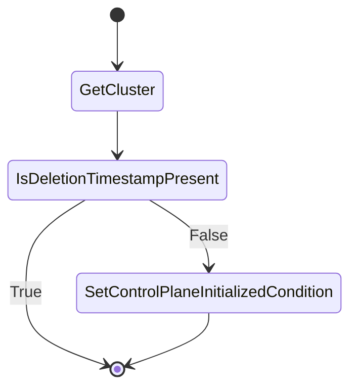

# Core Cluster controller

## Overview

[Core cluster controller](../../pkg/controllers/cluster/infra.go) is responsible for managing Cluster CRs. The cluster object will
represent the current cluster where operator is running because we treat this cluster as both [management and workload](https://cluster-api.sigs.k8s.io/user/concepts.html#management-cluster).
It's only purpose it to set `ControlPlaneInitialized` condition to true, in order to make Cluster API move the cluster
to provisioned phase. We don't manage control plane machines using Cluster API now.

## Behavior

