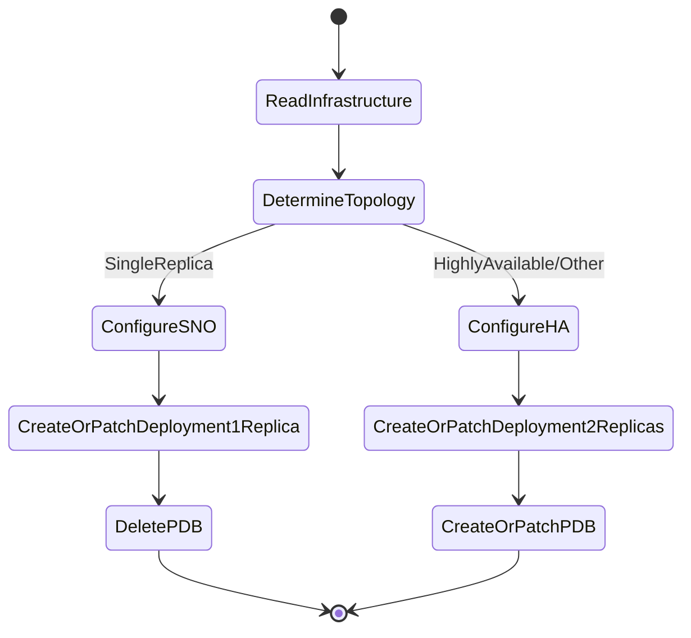

# CRD Compatibility Checker Operator

## Overview

[CRD Compatibility Checker Operator controller](../../pkg/controllers/crdcompatibilityoperator/controller.go) is a topology-aware operator that manages the CRD Compatibility Checker operand deployment based on cluster topology.

The CRD Compatibility Checker validates backward compatibility of CustomResourceDefinitions to prevent breaking changes during upgrades. This operator ensures the checker runs with the correct replica count and PodDisruptionBudget configuration based on whether the cluster is Single Node OpenShift (SNO) or High Availability (HA).

## Behavior

## Topology Detection

The controller watches the `Infrastructure` CR (name: `cluster`) and reads `status.controlPlaneTopology`:

- **SingleReplica** → Deployment replicas: 1, PDB: deleted
- **HighlyAvailable** (default) → Deployment replicas: 2, PDB: minAvailable=1
- **Other topologies** (DualReplica, HighlyAvailableArbiter, External) → Deployment replicas: 2, PDB: minAvailable=1

**Note:** For External topology (HyperShift/Hosted Control Planes), the operand is configured with master node scheduling constraints that may not be suitable. The webhook functionality may not work correctly when the control plane is external to the cluster.

## Watched Resources

- `Infrastructure` (cluster-scoped, name="cluster")
- `Deployment` (compatibility-requirements-controllers in openshift-compatibility-requirements-operator namespace)
- `PodDisruptionBudget` (compatibility-requirements-controllers-pdb in openshift-compatibility-requirements-operator namespace)

## Drift Correction

The controller continuously reconciles the Deployment and PDB to match the desired state based on current topology:

- If topology changes from HA to SNO → replicas scaled down to 1, PDB deleted
- If topology changes from SNO to HA → replicas scaled up to 2, PDB created
- If Deployment replicas are manually modified → corrected back to topology-appropriate value
- If PDB is manually deleted in HA mode → recreated

## Related Components

- **CRD Compatibility Checker** (operand): The actual checker binary that validates CRD compatibility
- **Manifests**: Static resources (namespace, RBAC, services) are managed by CVO
- **Operator Deployment**: The operator itself runs as a single-replica Deployment managed by CVO
