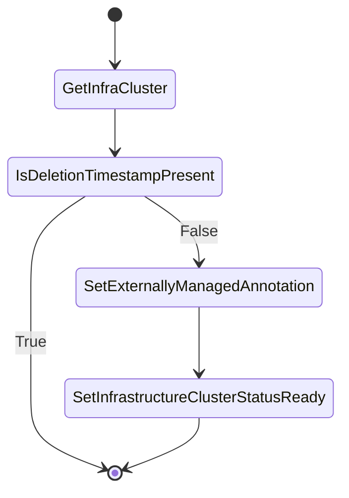

# Infra cluster controller

## Overview

[Infra cluster controller](../../pkg/controllers/cluster/infra.go) is responsible for managing InfrastructureCluster(AWSCluster, etc.) CRs. 
The infrastructure cluster object will represent the [infrastructure of the cloud(AWS,Azure,GCP, etc.)](https://cluster-api.sigs.k8s.io/user/concepts.html#infrastructure-provider) where current cluster is running.

The controller will set the cluster [externally managed](https://github.com/kubernetes-sigs/cluster-api/blob/main/docs/proposals/20210203-externally-managed-cluster-infrastructure.md) annotation `"cluster.x-k8s.io/managed-by"` and `Status.Ready` to `true` which indicates that the cluster is managed by the current controller and 
not managed by the CAPI infrastructure provider.

## Behavior

