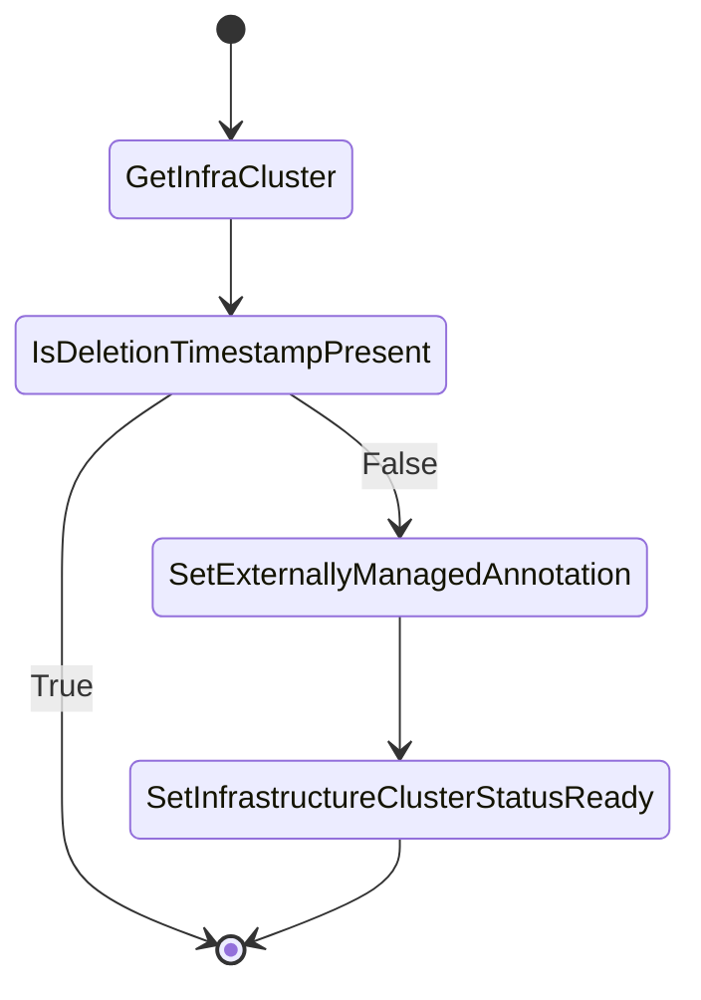

# Infra cluster controller

## Overview

Infra cluster controller is responsible for managing InfrastructureCluster(AWSCluster, etc.) CRs. 
The cluster object will represent the cloud infrastructure where current cluster where operator 
is running because we treat this cluster as both management and workload.

The controller will set the cluster [externally managed](https://github.com/kubernetes-sigs/cluster-api/blob/main/docs/proposals/20210203-externally-managed-cluster-infrastructure.md) annotation `"cluster.x-k8s.io/managed-by"` and `Status.Ready` 
to `true` which indicates that the cluster is managed by the current controller and not managed by the CAPI 
infrastructure provider.

## Behavior

```mermaid
stateDiagram-v2
    [*] --> GetInfraCluster
    GetInfraCluster --> IsDeletionTimestampPresent
    state IsDeletionTimestampPresent <<choice>>
    IsDeletionTimestampPresent --> [*]: True
    IsDeletionTimestampPresent --> SetExternallyManagedAnnotation: False
    SetExternallyManagedAnnotation --> SetInfrastructureClusterStatusReady
    SetInfrastructureClusterStatusReady --> [*]
```
