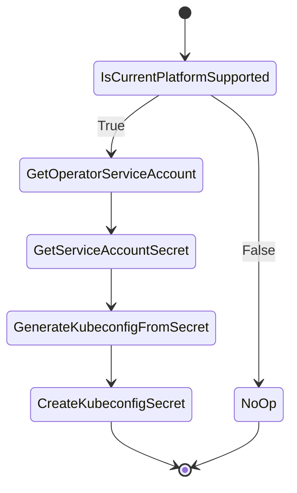

# Kubeconfig controller

## Overview

Kubeconfig controller generates a secret containing kubeconfig for the cluster. The kubeconfig is generated from the service account for operator. The kubeconfig is consumed by core CAPI controllers to link nodes and machines.

## Behavior

If the current platform is not supported, the controller will not create any secret and allow BYO scenarios. In case when the platform is supported, the controller will create the secret containing kubeconfig.
