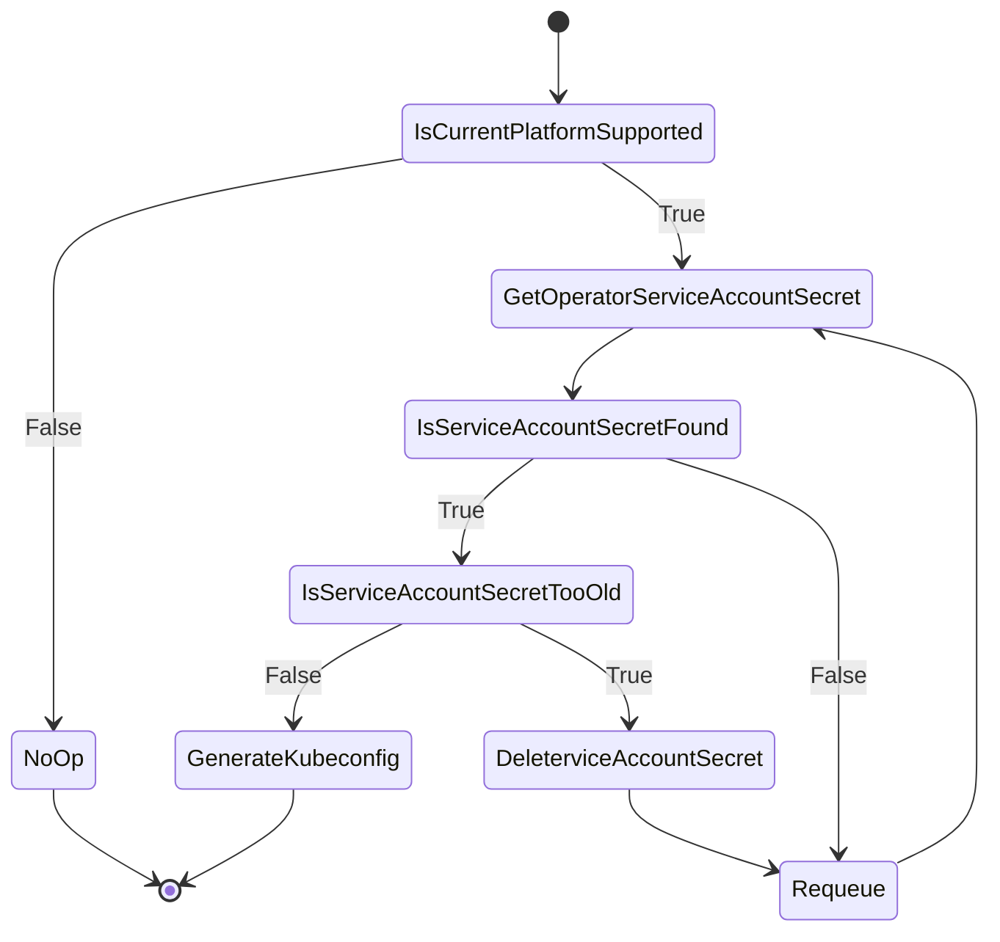

# Kubeconfig controller

## Overview

[Kubeconfig controller](../../pkg/controllers/kubeconfig/kubeconfig.go) generates a secret containing kubeconfig for the cluster. The kubeconfig is generated from the service account for operator. The kubeconfig is consumed by core CAPI controllers to link nodes and machines.

## Behavior

If the current platform is not supported, the controller will not create any secret and allow "bring your own" scenarios. 
In cases where the platform is supported, the controller will create the secret containing kubeconfig.

The controller will manage rotation of the service account secret that was initially created by the CVO. The token in the secret can exprire and has to
be rotated. The controller will periodically check if the secret is too old and if so, it will delete the secret and wait for 
CVO to create a new one.
