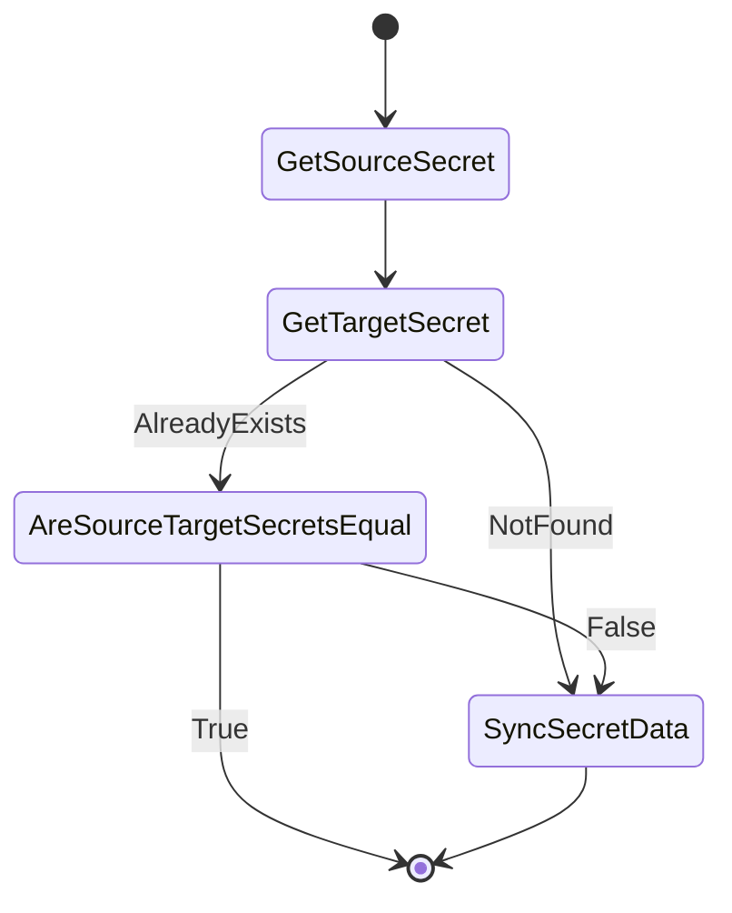

# Secret sync controller

## Overview

[Secret sync controller](../../pkg/controllers/secretsync/secret_sync_controller.go) is responsible for syncing `worker-user-data` secret that is created by installer in `openshift-machine-api` namespace. The secret is used to store ignition configuration data for worker nodes.

## Behavior

