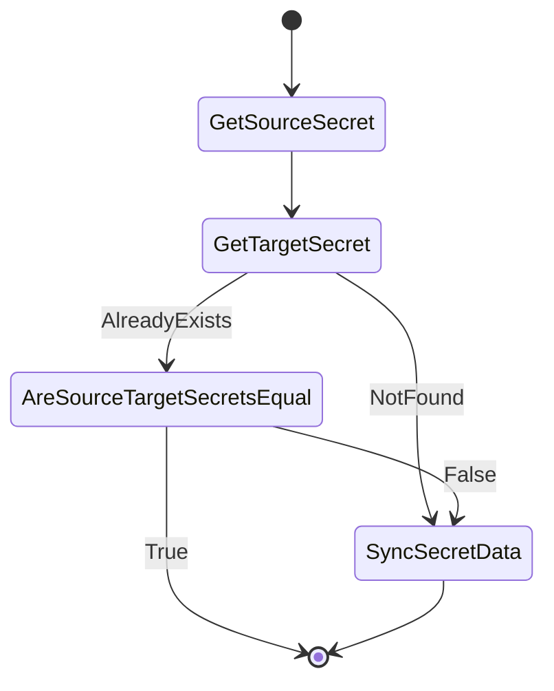

# Secret sync controller

## Overview

Secret sync controller is responsible for syncing `worker-user-data` secret from `openshift-machine-api` namespace to `openshift-cluster-api` namespace, it is created by the installer so we have no other to create it for now. The secret
is used to store ignition configuration data for worker nodes.

## Behavior

