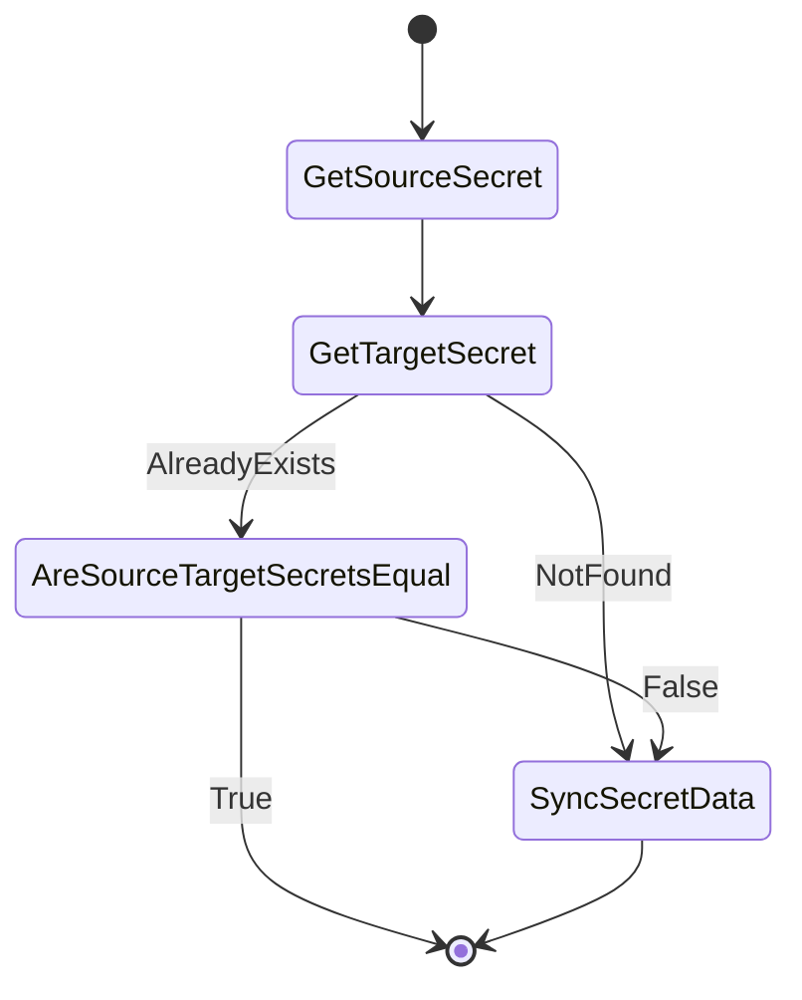

# Secret sync controller

## Overview

[Secret sync controller](../../pkg/controllers/secretsync/secret_sync_controller.go) is responsible for syncing `worker-user-data` and `master-user-data` secrets created by the installer in the `openshift-machine-api` namespace. These secrets store ignition configuration data for worker and control plane nodes, respectively.

## Behavior

